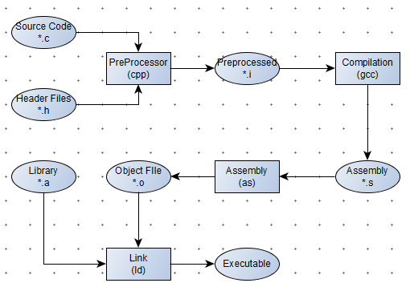
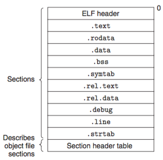
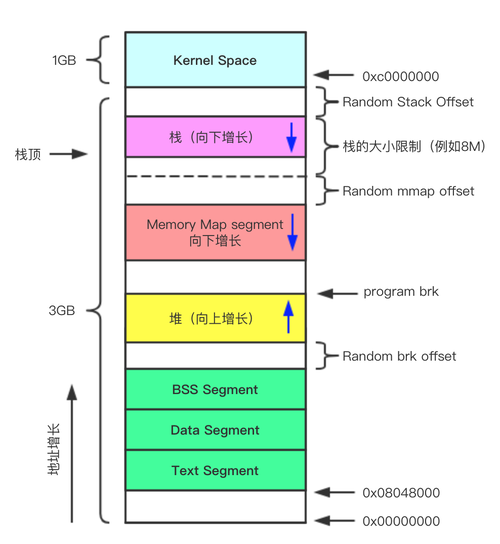
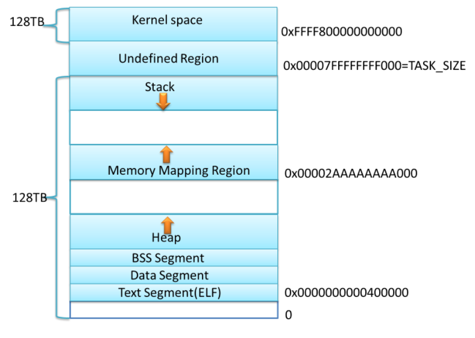

# 程序是如何运行起来的

## 1.从源文件到可执行文件

* 预处理

  预处理过程，主要是以下几部分：

  - 宏定义指令
    - 如 #define a b对于这种伪指令，预编译所要做的是将程序中的所有a用b替换，但作为字符串常量的 a则不被替换。
  - 条件编译指令
    - 如#ifdef，#ifndef，#else，#elif，#endif等。 这些伪指令的引入使得程序员可以通过定义不同的宏来决定编译程序对哪些代码进行处理。预编译程序将根据有关的文件，将那些不必要的代码过滤掉
  - 头文件包含指令
    - 如#include “FileName”或者#include 等。 该指令将头文件中的定义统统都加入到它所产生的输出文件中，以供编译程序对之进行处理。
  - 特殊符号
    - 预编译程序可以识别一些特殊的符号。 例如在源程序中出现的LINE标识将被解释为当前行号（十进制数），FILE则被解释为当前被编译的C源程序的名称。预编译程序对于在源程序中出现的这些串将用合适的值进行替换。

  关于头文件的搜索规则：

  - 所有头文件的搜寻从`-I`开始；
  - 然后在环境变量指定路径中寻找（环境变量如`C_INCLUDE_PATH`, `CPLUS_INCLUDE_PATH`, `OBJC_INCLUDE_PATH`等）；
  - 最后在默认目录中寻找（如`/usr/include`, `/usr/local/include`, `/usr/lib/gcc-lib/i386-linux/2.95.2/include`等）；

  

  示例：

  > g++ -E add.cpp -o add.i
  >
  > cpp add.cpp > add.i
  >
  > g++ -E main.cpp -o main.i
  >
  > cpp main.cpp > main.i

 

  
* 编译

  编译是把预处理完的文件进行一系列的词法分析，语法分析，语义分析及优化后生成相应的汇编代码。

  > g++ -S add.i -o add.s
  >
  > /usr/lib/gcc/x86_64-linux-gnu/7.5.0/cc1 add.cpp
  >
  > g++ -S main.i -o main.s
  >
  > /usr/lib/gcc/x86_64-linux-gnu/7.5.0/cc1 main.cpp

   

* 汇编

  汇编器是将汇编代码转变成机器可以执行的命令，每一个汇编语句几乎都对应一条机器指令。汇编相对于编译过程比较简单，根据汇编指令和机器指令的对照表一一翻译即可。汇编结束后的文件称为目标文件。

  目标文件类型：

* 可重定位目标文件：由编译器和汇编器生成，可与其他可重定位目标文件合并，创建一个可执行或共享的目标文件；
  > g++ -c -fPIC add.s -o add.o
  >
  > as add.s -o add.o
  > 
  > g++ -c main.s -o main.o
  >
  > as main.s -o main.o

 

* 共享目标文件：一种特殊的可重定位目标文件，可以在链接（静态共享库）时加入目标文件，也可以在加载或运行时（动态共享库）动态的被加载到内存并执行；
  > ar cr libadd.a add.o
  >
  > g++ -shared add.o -o libadd.so

 

* 链接

链接的主要工作是把各个模块之间相互引用的部分处理好，使各个模块之间可以正确衔接。

* 可执行目标文件：由链接器生成，可直接通过加载器加载到内存中，充当进程执行的文件；
  > g++ add.o main.o -o main-elf

目标文件的格式：

查看目标文件的头部信息
> readelf -h add.o

查看目标文件的分段信息
> objdump -h add.o

查看目标文件的详细内容
> objdump -s -d add.o

### 重定位表

编译器把所有需要被重定位的数据存放在重定位表中，这样链接器就能够知道该目标文件中哪些数据是需要被重定位的。

查看目标文件的重定位表

> objdump -r main.o

### 符号表

目标文件中的某些部分是需要在链接的时候被使用到的 “粘合剂”，这些部分我们可以把其称之为 “符号”，符号就保存在符号表中。符号表中保存的符号很多，其中最重要的就是定义在本目标文件中的可以被其它目标文件引用的符号和在本目标文件中引用的全局符号，这两个符号呈现互补的关系。

查看目标文件的符号表

> readelf -s main.o

## 2.从可执行文件到系统进程

加载

我们已经通过链接得到了可执行文件，在可执行文件中包含了很多的段（section），但是一旦这些段被加载到内存中之后，我们就不在乎他到底是什么类型的数据，而只在乎这份数据在内存中的读写权限。所以可执行文件被加载到内存中的数据可以分为两类：可读不可写和可读可写。

由于现代操作系统均采用分页的方式来管理内存，所以操作系统只需要读取可执行文件的文件头，之后建立起可执行文件到虚拟内存的映射关系，而不需要真正的将程序载入内存。在程序的运行过程中，CPU 发现有些内存页在物理内存中并不存在并因此触发缺页异常，此时 CPU 将控制权限转交给操作系统的异常处理函数，操作系统负责将此内存页的数据从磁盘上读取到物理内存中。数据读取完毕之后，操作系统让 CPU jmp 到触发了缺页异常的那条指令处继续执行，此时指令执行就不会再有缺页异常了。

忽略物理内存地址以及缺页异常的影响，一旦操作系统创建进程 (fork) 并载入了可执行文件 (exec)，那么虚拟内存的分布应该如下图所示。

运行

操作系统 jmp 到进程的第一条指令并不是 main 方法，而是别的代码。这些代码负责初始化 main 方法执行所需要的环境并调用 main 方法执行，运行这些代码的函数被称为入口函数或者入口点（Entry Point）。

一个程序的执行过程如下：

* 操作系统在创建进程之后，jmp 到这个进程的入口函数
* 入口函数对程序运行环境进行初始化，包括堆、I/O、线程、全局变量的构造，等等
* 入口函数在完成初始化之后，调用 main 函数，开始执行程序的主体
* main 函数执行完毕之后返回到入口函数，入口函数进行清理工作，最后通过系统调用结束进程

---

分析